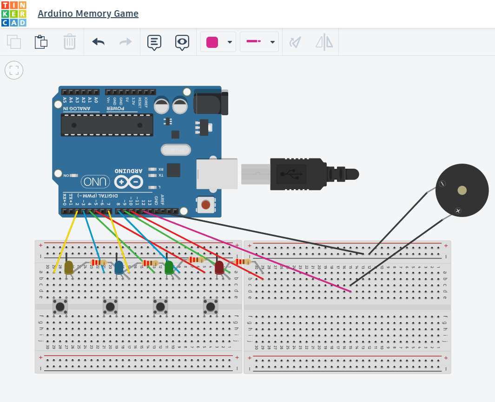

# Arduino Memory Game
- A memory game using the Arduino microcontroller, LEDs, buttons, and a piezo buzzer.
- Players must watch the LED sequence and repeat it by pressing the matching buttons. Each round adds a new step to the sequence.

## Demo and Links
https://youtube.com/shorts/1UGmg3GiB4w?feature=share

## Overview
This project is a LED memory game built using an Arduino. The system generates a random sequence of LEDs and tones which the user must memorize and repeat by pressing the corresponding buttons. If the user enters the correct sequence for the round, then the next round the length of the sequence increases, making it more challenging for the user. If the user enters an incorrect sequence, then the game tells the user their score in the Serial output and restarts the game.

This is my first project using an Arduino and it allowed me to learn the fundamentals of embedded systems programming, including digital input/output, circuit/code design, and integrating hardware components.

## Hardware Components
- Arduino Microcontroller
- 4 LEDs
- 4 push buttons
- 4 resistors (220Ω)
- Piezo buzzer
- Breadboard
- Jumper wires

### Circuit Diagram

- This is the HTML tag version for image embedded:

## How it works - probably go in overview at high level and below more low level 
1. arduino generates random sequence of led signals
2. seqence then played w light and sound
3. player repeats by clicking corresponding btn
4. arduino checks input against correct sequence
5. if correct, next round and sequence increases
6. if incorrect game ends and resets 

- high level - "This project was built as my first hands-on embedded systems project to learn Arduino programming and hardware interaction."
- Buttons use the Arduino's internal pull-up resistors to simplify the circuit and reduce the number of external components.

### Code Structure
- setup() - initializes hardware (LED pins & buzzer are outputs; button pins are input)
- loop() - main game loop and heart of the program's logic

- Helper methods:
- - flashButtonSignal() - Turn on LED and play its note 
- - playSequence() - Show the current memory pattern on the Arduino
- - getButtonPress() - Check if the user presses a button and return the button pressed
- - isPlayerCorrect() - Check whether the player pressed the correct button(s) for the round
- - playFailSound() - Play the game over sound when the player clicks the incorrect button sequence
- - playWinSound() - Play the win sound when the player clicks the correct button(s) for the sequence
- - gameOver() - Tells the user their score in the serial output
basically list all methods

## Skills Learned/Improved
microcontroller and electronics basics (LEDs, buzzer, resistor)
circuit design
digital input/output on microcontrollers - integrating hardware and software systems
writing code for modular functions and utilizing them
handling user input with hardware buttons
basic embedded systems programming (C++)

## Future Improvements
- Add a OLED display for level and score
- Build 3d printed enclosure 
- make a leaderboard

## Setup Instructions
1. Follow circuit diagram to set up LEDs, resistors, button, buzzer, and wires 
2. Connect LEDs to pins 7-10.
3. Conncet buttons to pins 2-5.
4. Connect buzzer to pin 12
5. Upload Arduino sketch and power board